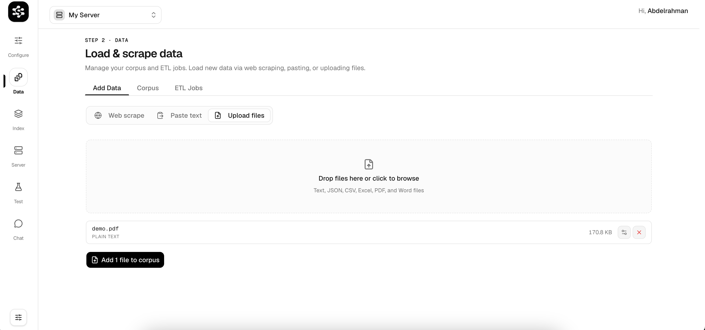
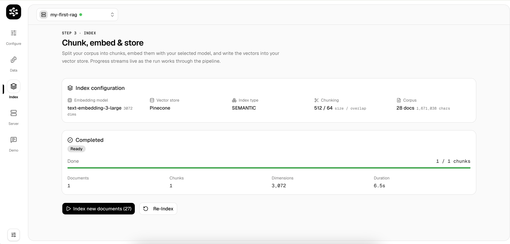
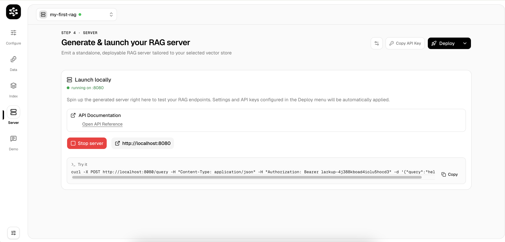
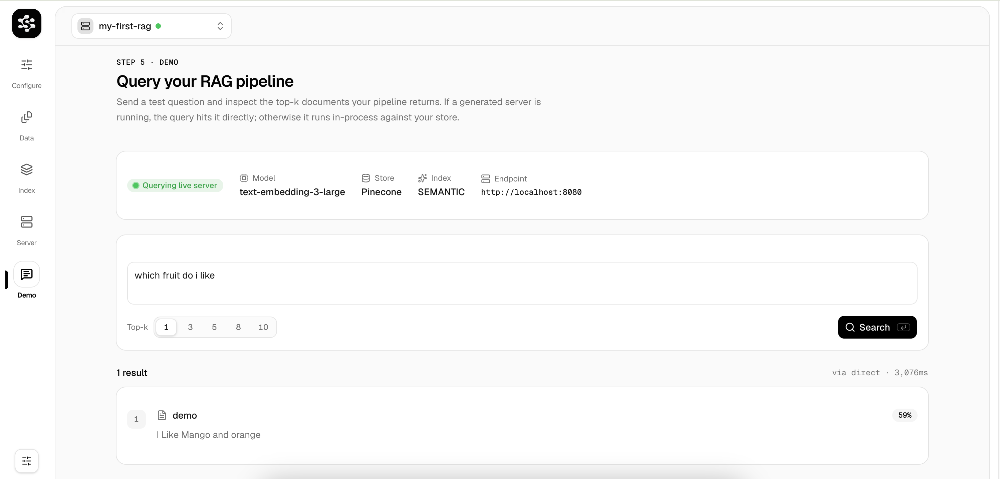

<div align="center">
  

  <br />

**Open-source Custom AI infrastructure — ingest, index, and deploy production-ready vector search APIs in minutes.**

[Documentation](https://larkup.larkup.de/docs) · [GitHub Issues](https://github.com/Larkup-AI/larkup/issues)

</div>

---

## ⚡ Installation

### Quick Install (macOS / Linux / WSL)

Pick the method that fits your setup:

#### Global Install — uses your system Node.js

Best when you already have Node.js 18+ installed and want `larkup` available system-wide via npm.

```bash
curl -fsSL https://larkup.de/install.sh | bash
```

This will:

1. Detect your OS and architecture
2. Check for Node.js ≥ 18 (offers to install v20 via your package manager if missing)
3. Install `@larkup/cli` globally with `npm install -g`
4. Ensure the `larkup` binary is on your `PATH`

#### Self-Contained Install — no root, no system Node

Best for machines where you don't have root access, don't want to touch system packages, or want a clean isolated setup.

```bash
curl -fsSL https://larkup.de/install-local.sh | bash
```

This will:

1. Create a self-contained directory at `~/.larkup/`
2. Download a portable Node.js v20 binary (no system Node required)
3. Install the CLI into the local prefix
4. Create a wrapper script at `~/.larkup/bin/larkup`
5. Add `~/.larkup/bin` to your `PATH`

To uninstall, just remove the directory:

```bash
rm -rf ~/.larkup
```

Custom install prefix:

```bash
curl -fsSL https://larkup.de/install-local.sh | bash -s -- --prefix ~/tools/larkup
```

#### Comparing the two installers

|                      | `install.sh` (Global)                                   | `install-local.sh` (Self-Contained)                          |
| -------------------- | ------------------------------------------------------- | ------------------------------------------------------------ |
| **Node.js**          | Uses your existing system Node (installs it if missing) | Downloads its own portable Node — nothing touches the system |
| **Install location** | npm global directory (e.g. `/usr/local/lib/…`)          | `~/.larkup/` (or custom `--prefix`)                          |
| **Root / sudo**      | May need sudo to install Node or npm globals            | Never needs root                                             |
| **Uninstall**        | `npm uninstall -g @larkup/cli`                          | `rm -rf ~/.larkup`                                           |
| **Best for**         | Dev machines with Node already set up                   | CI, Docker containers, shared servers, sandboxed setups      |

Both installers support these flags:

| Flag              | Description                                        |
| ----------------- | -------------------------------------------------- |
| `--version <ver>` | Install a specific CLI version (default: `latest`) |
| `--no-prompt`     | Skip interactive confirmations (CI-friendly)       |
| `--dry-run`       | Preview what would happen without making changes   |
| `--verbose`       | Show debug output for troubleshooting              |

Example — CI-friendly install with a pinned version:

```bash
curl -fsSL https://larkup.de/install.sh | bash -s -- --version 1.2.0 --no-prompt
```

### Windows (PowerShell)

```powershell
iwr -useb https://larkup.de/install.ps1 | iex
```

Or with options:

```powershell
powershell -c "& ([scriptblock]::Create((irm https://larkup.de/install.ps1))) -Version 1.2.0 -DryRun"
```

### Docker

```bash
docker run -d -p 4567:4567 \
  -e OPENAI_API_KEY=your_key \
  ghcr.io/larkup-ai/larkup:latest
```

Or with Docker Compose:

```bash
git clone https://github.com/Larkup-AI/larkup.git
cd larkup
docker-compose up -d
```

### From Source

```bash
git clone https://github.com/Larkup-AI/larkup.git
cd larkup
pnpm install
pnpm dev
```

### Once installed

```bash
larkup init my-custom-ai-server
cd my-custom-ai-server
larkup dev
```

---

## 🧭 How It Works

Once running, open **http://localhost:4567** and follow these steps:

### 1. Configure your pipeline

Pick your vector store (LanceDB, Pinecone, Chroma…) and embedding provider (OpenAI, Cohere…) — all from the UI.


### 2. Ingest your data

Upload files (PDF, TXT, DOCX), paste raw text, or scrape URLs directly from the Data tab.



### 3. Run the ETL pipeline

Kick off indexing to automatically chunk, embed, and store your documents into the vector database.



### 4. Launch your custom AI server

Your server is ready — get a live API endpoint with built-in Scalar API docs.



### 5. Test with the built-in Chat Demo

Verify retrieval quality before connecting external agents.



### 6. Deploy to production

Ship to Vercel, Hetzner/VPS via SSH, or any Docker-compatible cloud — one click from the UI.


---

## 🔌 Connect via SDK

Once your server is live (locally or deployed), connect your AI agents using our SDKs:

```bash
npm install @larkup/sdk    # TypeScript / Node.js
pip install larkup          # Python
```

### Vercel AI SDK

```typescript
import { tool } from "ai";
import { z } from "zod";
import { LarkupClient } from "@larkup/sdk";

const larkupClient = new LarkupClient({
  baseUrl: "https://your-server-url.com", // or http://localhost:8080 for local
  apiKey: "your-api-key",
});

export const larkupTool = tool({
  description: "Search the knowledge base for relevant context.",
  parameters: z.object({ query: z.string() }),
  execute: async ({ query }) => {
    const results = await larkupClient.query(query, 5);
    return results.hits.map((hit) => hit.text).join("\n\n");
  },
});
```

### LangChain (Python)

```python
from langchain_core.retrievers import BaseRetriever
from langchain_core.documents import Document
from larkup import LarkupClient, LarkupClientOptions

class LarkupRetriever(BaseRetriever):
    client: LarkupClient

    def _get_relevant_documents(self, query, **kwargs):
        results = self.client.query(query, top_k=5)
        return [
            Document(page_content=hit.text, metadata={"score": hit.score})
            for hit in results.hits
        ]

retriever = LarkupRetriever(
    client=LarkupClient(LarkupClientOptions(
        base_url="https://your-server-url.com",  # or http://localhost:8080
        api_key="your-api-key"
    ))
)
```

### OpenAI-Compatible Endpoint

Every server exposes an OpenAI-compatible API — works with any framework:

```typescript
import { createOpenAI } from "@ai-sdk/openai";
import { generateText } from "ai";

const larkup = createOpenAI({
  baseURL: "https://your-server-url.com/v1", // or http://localhost:8080/v1
  apiKey: "your-api-key",
});

const { text } = await generateText({
  model: larkup("my-model"),
  prompt: "What is Larkup?",
});
```

---

## 🏗️ Architecture

| Package           | Description                                                    |
| ----------------- | -------------------------------------------------------------- |
| `apps/web`        | Web UI & API server — configure pipelines, ingest data, deploy |
| `apps/cli`        | CLI to init, index, and query pipelines from the terminal      |
| `apps/sdk/js-sdk` | TypeScript/JS SDK (`@larkup/sdk`)                              |
| `apps/sdk/py-sdk` | Python SDK (`larkup`)                                          |
| `apps/docs`       | Documentation site (Mintlify)                                  |

## 📚 Documentation

Full guides → [larkup.larkup.de/docs](https://larkup.larkup.de/docs)

## 🤝 Contributing

We welcome contributions! Open an [issue](https://github.com/Larkup-AI/larkup/issues) or submit a pull request.

## 📄 License

Larkup operates on an **Open Core** licensing model.

- **Community Edition**: The core framework is fully open source and self-hostable, licensed under the [Apache License 2.0](./LICENSE).
- **Enterprise Edition**: Advanced features in the `ee/` directory are proprietary, closed-source, and require a valid commercial license. See [LICENSE-ENTERPRISE.md](./LICENSE-ENTERPRISE.md) for details.

Copyright (c) 2024-2026 Larkup UG
