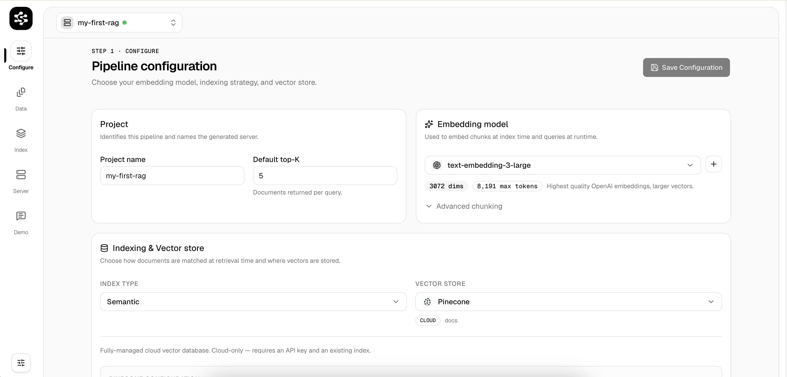
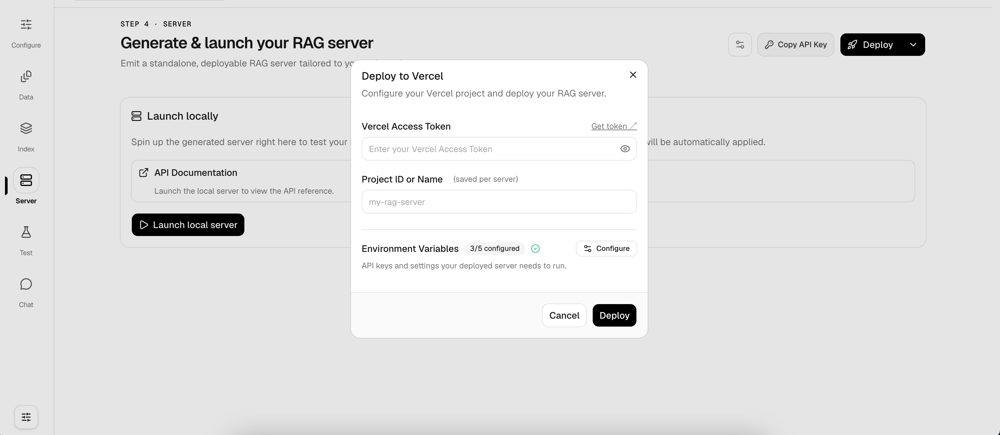

<div align="center">
  

  <br />

**Open-source RAG infrastructure — ingest, index, and deploy production-ready vector search APIs in minutes.**

[Documentation](https://larkuprag.larkup.de/docs) · [GitHub Issues](https://github.com/Larkup-AI/larkup-rag/issues)

</div>

---

## ⚡ Getting Started

### Option 1: CLI (quickest)

```bash
npx @larkup-rag/cli init my-rag-server
cd my-rag-server
npx @larkup-rag/cli dev
```

### Option 2: Docker

```bash
docker run -d -p 4567:4567 \
  -e OPENAI_API_KEY=your_key \
  ghcr.io/larkup-ai/larkup-rag:latest
```

Or with Docker Compose:

```bash
git clone https://github.com/Larkup-AI/larkup-rag.git
cd larkup-rag
docker-compose up -d
```

### Option 3: From source

```bash
git clone https://github.com/Larkup-AI/larkup-rag.git
cd larkup-rag
pnpm install
pnpm dev
```

---

## 🧭 How It Works

Once running, open **http://localhost:4567** and follow these steps:

### 1. Configure your pipeline

Pick your vector store (LanceDB, Pinecone, Chroma…) and embedding provider (OpenAI, Cohere…) — all from the UI.



### 2. Ingest your data

Upload files (PDF, TXT, DOCX), paste raw text, or scrape URLs directly from the Data tab.


### 3. Run the ETL pipeline

Kick off indexing to automatically chunk, embed, and store your documents into the vector database.


### 4. Launch your RAG server

Your server is ready — get a live API endpoint with built-in Scalar API docs.


### 5. Test with the built-in Chat Demo

Verify retrieval quality before connecting external agents.


### 6. Deploy to production

Ship to Vercel, Hetzner/VPS via SSH, or any Docker-compatible cloud — one click from the UI.



---

## 🔌 Connect via SDK

Once your server is live (locally or deployed), connect your AI agents using our SDKs:

```bash
npm install @larkup/rag-sdk    # TypeScript / Node.js
pip install larkup-rag          # Python
```

### Vercel AI SDK

```typescript
import { tool } from "ai";
import { z } from "zod";
import { LarkupRAGClient } from "@larkup/rag-sdk";

const rag = new LarkupRAGClient({
  baseUrl: "https://my-rag-server.vercel.app",
  apiKey: "your-api-key",
});

export const ragTool = tool({
  description: "Search the knowledge base for relevant context.",
  parameters: z.object({ query: z.string() }),
  execute: async ({ query }) => {
    const results = await rag.query(query, 5);
    return results.hits.map((hit) => hit.text).join("\n\n");
  },
});
```

### LangChain (Python)

```python
from langchain_core.retrievers import BaseRetriever
from langchain_core.documents import Document
from larkup_rag import LarkupRAGClient, LarkupRAGClientOptions

class LarkupRetriever(BaseRetriever):
    client: LarkupRAGClient

    def _get_relevant_documents(self, query, **kwargs):
        results = self.client.query(query, top_k=5)
        return [
            Document(page_content=hit.text, metadata={"score": hit.score})
            for hit in results.hits
        ]

retriever = LarkupRetriever(
    client=LarkupRAGClient(LarkupRAGClientOptions(
        base_url="https://my-rag-server.vercel.app",
        api_key="your-api-key"
    ))
)
```

### OpenAI-Compatible Endpoint

Every server exposes an OpenAI-compatible API — works with any framework:

```typescript
import { createOpenAI } from "@ai-sdk/openai";
import { generateText } from "ai";

const larkup = createOpenAI({
  baseURL: "https://my-rag-server.vercel.app/v1",
  apiKey: "your-api-key",
});

const { text } = await generateText({
  model: larkup("rag-model"),
  prompt: "What is LarkupRAG?",
});
```

---

## 🏗️ Architecture

| Package | Description |
|---|---|
| `apps/web` | Web UI & API server — configure pipelines, ingest data, deploy |
| `apps/cli` | CLI to init, index, and query pipelines from the terminal |
| `apps/sdk/js-sdk` | TypeScript/JS SDK (`@larkup/rag-sdk`) |
| `apps/sdk/py-sdk` | Python SDK (`larkup-rag`) |
| `apps/docs` | Documentation site (Mintlify) |

## 📚 Documentation

Full guides → [larkuprag.larkup.de/docs](https://larkuprag.larkup.de/docs)

## 🤝 Contributing

We welcome contributions! Open an [issue](https://github.com/Larkup-AI/larkup-rag/issues) or submit a pull request.

## 📄 License

[MIT](./LICENSE) — Copyright (c) 2024-2026 Larkup UG
