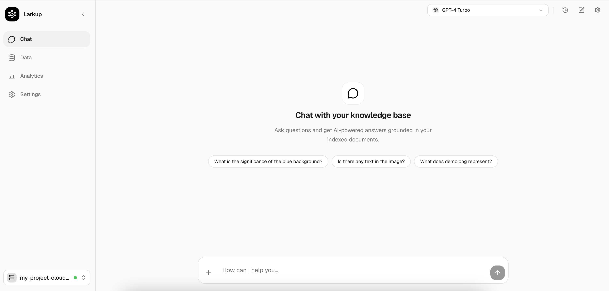

<div align="center">
  

  <br />

**Open source tools for building a private AI over your own data.**

[Documentation](https://larkup.de/docs) · [GitHub Issues](https://github.com/Larkup-AI/larkup/issues)

</div>

---

Larkup brings files, websites, text, structured data, and media into one searchable knowledge base. Use the Web UI to chat with that data, analyze it, or expose it through a generated RAG API.

## Installation

### Docker

```bash
docker run -d -p 4567:4567 \
  -e OPENAI_API_KEY=your_key \
  aboneda/larkup:latest
```

Or use Docker Compose:

```bash
git clone https://github.com/Larkup-AI/larkup.git
cd larkup
docker compose up -d
```

### From source

```bash
git clone https://github.com/Larkup-AI/larkup.git
cd larkup
pnpm install
pnpm dev
```

Open [http://localhost:4567](http://localhost:4567) after Larkup starts.

## Quickstart

1. Add an API key during onboarding.
2. Open **Data** and add a website, integration, CSV, PDF, or video.
3. Open **Chat** and ask a question about the indexed content.

Larkup opens its local web app at `http://localhost:4567`. Start generated servers from the app when you need an API endpoint.



See the [Quickstart guide](https://larkup.de/docs/guide/quickstart) for screenshots of every data source.

## CLI

Install the CLI:

```bash
npm install -g larkup
```

Start the Larkup web app:

```bash
larkup dev
```

You can also use `larkup query`, `larkup chat`, `larkup documents`, `larkup media`, and `larkup marketplace` from the terminal. See the [CLI reference](https://larkup.de/docs/developer/cli) for every command.

## SDKs

Generated servers use port `8080` by default. The TypeScript and Python clients expose the same retrieval, document, scraping, and streaming chat capabilities.

### TypeScript

```bash
npm install @larkup/sdk
```

```typescript
import { LarkupClient } from "@larkup/sdk";

const client = new LarkupClient({
  baseUrl: "http://localhost:8080",
  apiKey: process.env.LARKUP_API_KEY,
});

const results = await client.query("What is the refund policy?", 5);

for await (const event of client.chat("Summarize the answer.")) {
  if (event.type === "text-delta") process.stdout.write(event.text ?? "");
}
```

### Python

```bash
pip install larkup
```

```python
from larkup import LarkupClient, LarkupClientOptions

client = LarkupClient(
    LarkupClientOptions(
        base_url="http://localhost:8080",
        api_key="your-api-key",
    )
)

results = client.query("What is the refund policy?", top_k=5)

for event in client.chat("Summarize the answer."):
    if event.type == "text-delta":
        print(event.text or "", end="", flush=True)
```

Read the [TypeScript SDK](https://larkup.de/docs/sdk/typescript), [Python SDK](https://larkup.de/docs/sdk/python), or [API reference](https://larkup.de/docs/api-reference/overview) for the complete interfaces.

## Repository

| Path | Purpose |
| --- | --- |
| `apps/web` | Web UI and API routes |
| `apps/cli` | Command line interface |
| `apps/sdk/js-sdk` | TypeScript SDK |
| `apps/sdk/py-sdk` | Python SDK |
| `apps/desktop` | Desktop application |
| `packages/core` | Shared configuration and server generation |
| `docs` | Mintlify documentation |

## Contributing

Open an [issue](https://github.com/Larkup-AI/larkup/issues) or submit a pull request.

## License

Larkup uses an **Open Core** licensing model.

- **Community Edition:** The core framework is open source and licensed under the [Apache License 2.0](./LICENSE).
- **Enterprise Edition:** Advanced features in `ee/` are proprietary and require a commercial license. See [LICENSE-ENTERPRISE.md](./LICENSE-ENTERPRISE.md).

Copyright (c) 2024 to 2026 Larkup UG
