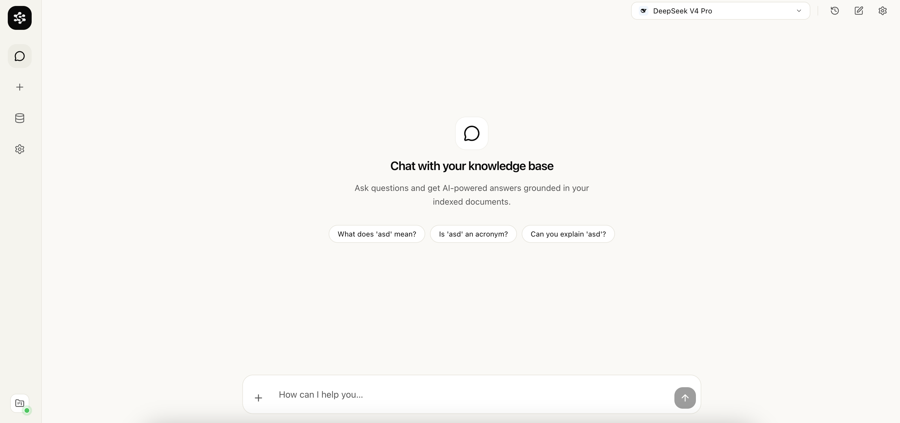
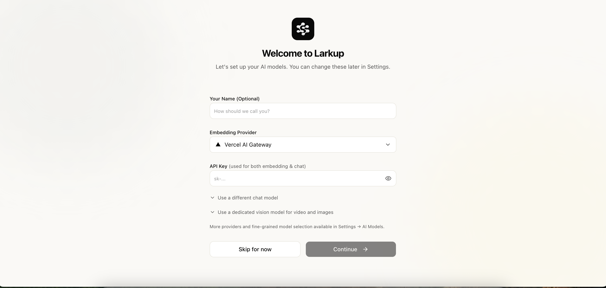
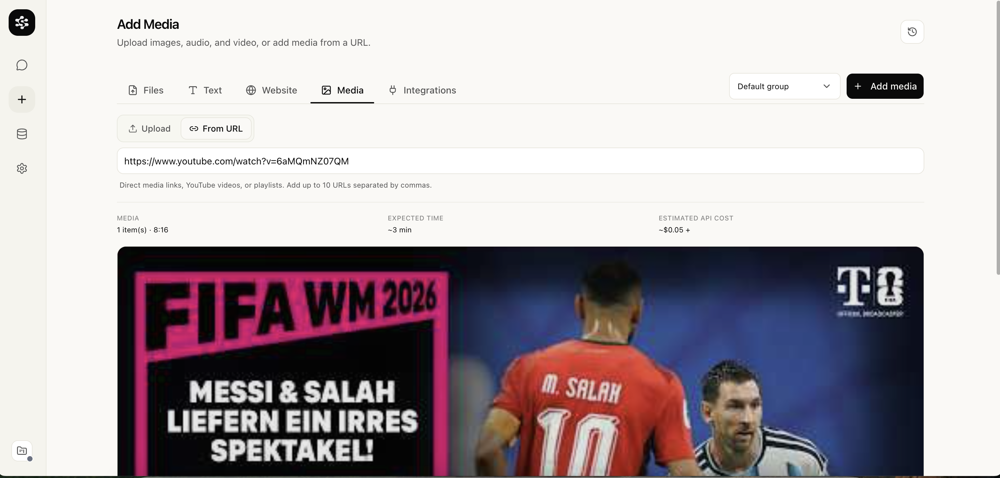
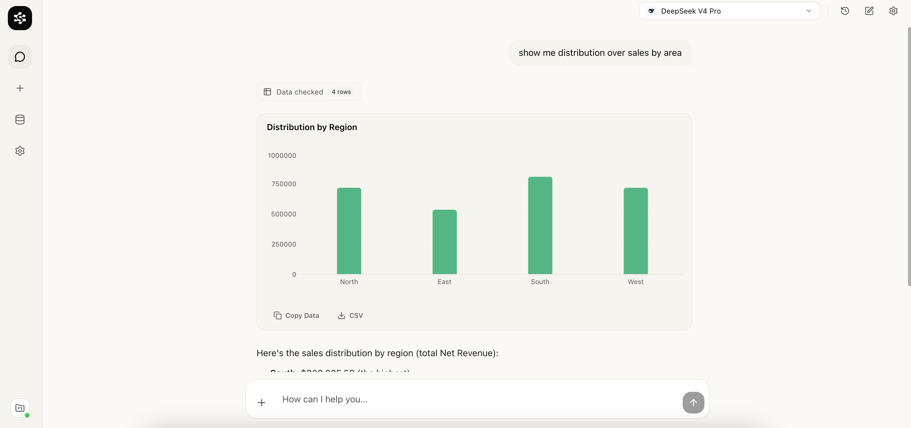
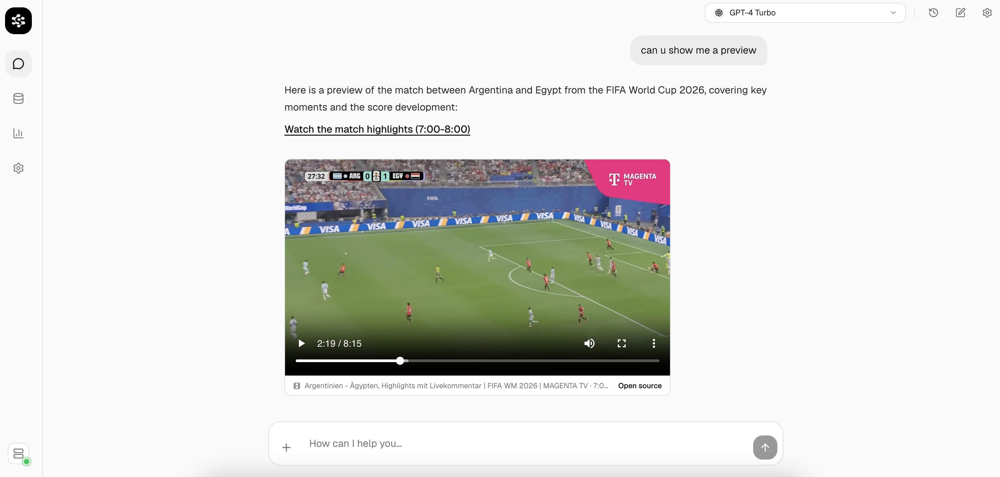
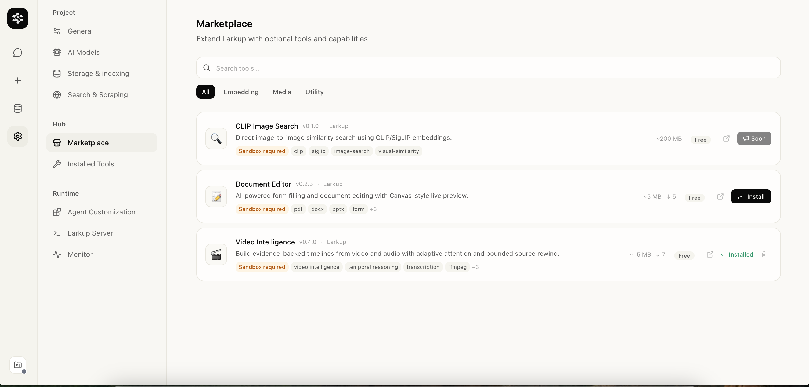
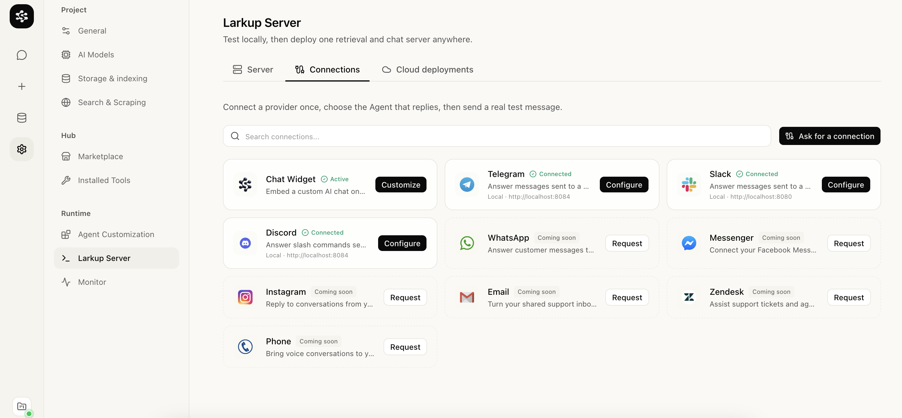
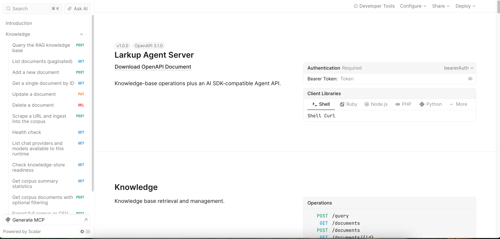

<div align="center">
  

  <br />

**Open source tools for building a private AI over your own data.**

[Documentation](https://www.larkup.de/docs) · [GitHub Issues](https://github.com/Larkup-AI/larkup/issues)

</div>

---

> [!WARNING]
> **Larkup is under active development.** It is not yet stable: interfaces,
> stored data formats, and package APIs change between releases, and some
> features are still incomplete. Pin an exact version if you build on it, check
> the [release notes](https://github.com/Larkup-AI/larkup/releases) before
> upgrading, and expect to migrate. Please do
> [open issues](https://github.com/Larkup-AI/larkup/issues) — feedback at this
> stage is genuinely useful.

Larkup brings files, websites, text, structured data, and media into one searchable knowledge base. Use the Web UI to chat with that data, analyze it, or expose it through a generated RAG API.



## Installation

### Docker

```bash
docker run -d -p 4567:4567 -p 8080-8090:8080-8090 -v larkup_data:/app/apps/web/.larkup \
  -e OPENAI_API_KEY=your_key \
  aboneda/larkup:latest
```

Or use Docker Compose:

```bash
git clone https://github.com/Larkup-AI/larkup.git
cd larkup
docker compose -f docker/docker-compose-prod.yaml up -d
```

The dashboard uses port `4567`. Local Knowledge Servers launched from Settings use `8080` through `8090`; keep both mappings and the `/app/apps/web/.larkup` volume when running Docker. See [docker/README.md](./docker/README.md) for the optional web-crawler profile.

### From source

```bash
git clone https://github.com/Larkup-AI/larkup.git
cd larkup
pnpm install
pnpm dev
```

Open [http://localhost:4567](http://localhost:4567) after Larkup starts.

## Quickstart

1. Add an API key during onboarding.
2. Open **Data** and add a website, integration, CSV, PDF, or video.
3. Open **Chat** and ask a question about the indexed content.



Larkup opens its local web app at `http://localhost:4567`. Start a regular generated server from **Settings → Server** when you need an API endpoint; Docker users can reach its API and reference at `http://localhost:8080` and `http://localhost:8080/reference`.

See the [Quickstart guide](https://www.larkup.de/docs/guide/quickstart) for screenshots of every data source.

## What you can index

Files, websites, plain text, spreadsheets, and media all land in the same corpus, so one question can draw on all of them.



Tabular sources keep their structure, so a question can be answered by a chart instead of a paragraph.



Read [Data loading](https://www.larkup.de/docs/guide/data-loading) and [Data analysis](https://www.larkup.de/docs/guide/data-analysis) for the full set.

## Video intelligence

Video is indexed into timestamped, citable evidence rather than a single transcript blob, so an answer can point at the moment it came from.



See the [Video chat guide](https://www.larkup.de/docs/guide/video-chat) and the [video-intelligence tool](https://www.larkup.de/docs/marketplace/tools/video-intelligence).

## Marketplace tools

Capabilities that are not part of the core install — video intelligence, the document editor, CLIP embeddings — are installed per project from the marketplace.



See [Installing tools](https://www.larkup.de/docs/marketplace/installing-tools), [Creating tools](https://www.larkup.de/docs/marketplace/creating-tools), and [Publishing tools](https://www.larkup.de/docs/marketplace/publishing-tools).

## Connections

An indexed project can answer from Slack, Discord, or Telegram as well as from the dashboard.



## Generated servers

Every project can be exposed as a documented RAG API with its own OpenAPI reference.



See [Build a RAG server](https://www.larkup.de/docs/guide/build-rag-server) and [Deploy](https://www.larkup.de/docs/developer/deploy).

## CLI

Install the CLI:

```bash
npm install -g larkup
```

Start the Larkup web app:

```bash
larkup dev
```

You can also use `larkup query`, `larkup chat`, `larkup documents`, `larkup media`, and `larkup marketplace` from the terminal. See the [CLI reference](https://www.larkup.de/docs/developer/cli) for every command.

## SDKs

Generated servers use port `8080` by default. The TypeScript and Python clients expose the same retrieval, document, scraping, and streaming chat capabilities.

### TypeScript

```bash
npm install @larkup/sdk
```

```typescript
import { LarkupClient } from '@larkup/sdk';

const client = new LarkupClient({
  baseUrl: 'http://localhost:8080',
  apiKey: process.env.LARKUP_API_KEY,
});

const results = await client.query('What is the refund policy?', 5);

for await (const event of client.chat('Summarize the answer.')) {
  if (event.type === 'text-delta') process.stdout.write(event.text ?? '');
}
```

### Python

```bash
pip install larkup
```

```python
from larkup import LarkupClient, LarkupClientOptions

client = LarkupClient(
    LarkupClientOptions(
        base_url="http://localhost:8080",
        api_key="your-api-key",
    )
)

results = client.query("What is the refund policy?", top_k=5)

for event in client.chat("Summarize the answer."):
    if event.type == "text-delta":
        print(event.text or "", end="", flush=True)
```

Read the [TypeScript SDK](https://www.larkup.de/docs/sdk/typescript), [Python SDK](https://www.larkup.de/docs/sdk/python), or [API reference](https://www.larkup.de/docs/api-reference/overview) for the complete interfaces.

## Repository

| Path                          | Purpose                                          |
| ----------------------------- | ------------------------------------------------ |
| `apps/web`                    | Web UI and API routes                            |
| `apps/cli`                    | Command line interface                           |
| `apps/sdk/js-sdk`             | TypeScript SDK                                   |
| `apps/sdk/py-sdk`             | Python SDK                                       |
| `apps/desktop`                | Desktop application                              |
| `apps/marketplace`            | Marketplace Hub API                              |
| `packages/core`               | Shared configuration and server generation       |
| `packages/vector-stores`      | Vector store adapters                            |
| `packages/marketplace`        | Marketplace client, schema, and tool installer   |
| `packages/marketplace-tools`  | Installable tools (video intelligence, doc editor, CLIP) |
| `packages/connections`        | Channel adapters and inbound dispatch            |
| `packages/scraper`            | Web scraping and crawling                        |
| `packages/sandbox`            | Sandboxed tool execution                         |
| `packages/integrations`       | Third-party data source integrations             |
| `e2e`                         | Playwright end-to-end suite                      |
| `docs`                        | Mintlify documentation                           |

## Contributing

Read [CONTRIBUTING.md](./CONTRIBUTING.md) for the local setup, the test and type-check commands, and the changeset workflow. Then open an [issue](https://github.com/Larkup-AI/larkup/issues) or submit a pull request.

## License

Larkup uses an **Open Core** licensing model.

- **Community Edition:** everything in this repository is open source and licensed under the [Apache License 2.0](./LICENSE).
- **Enterprise Edition:** advanced features are proprietary, are not distributed in this repository, and require a commercial license. Contact [Larkup](https://www.larkup.de) for terms.

Copyright (c) 2024 to 2026 Larkup UG
